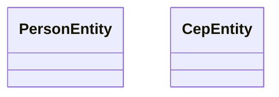
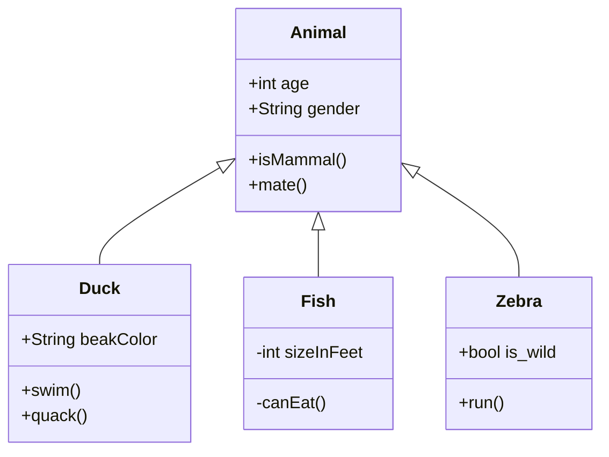
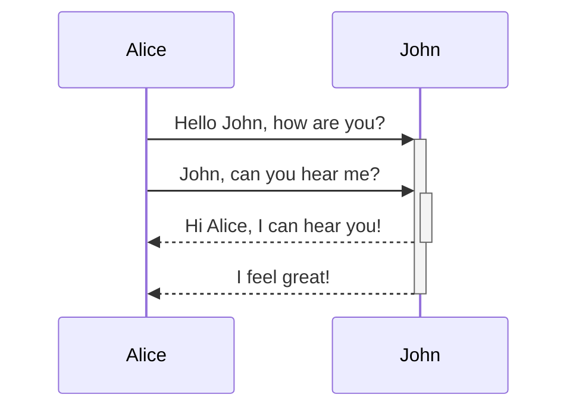
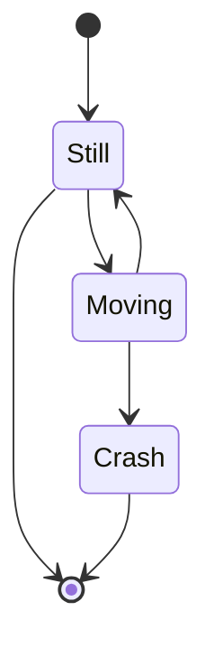
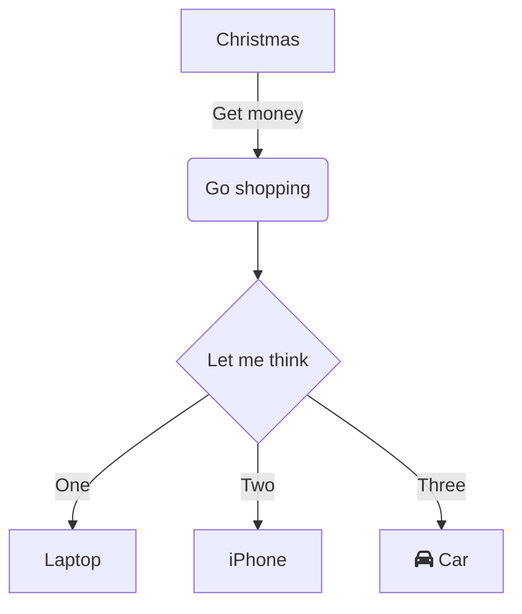
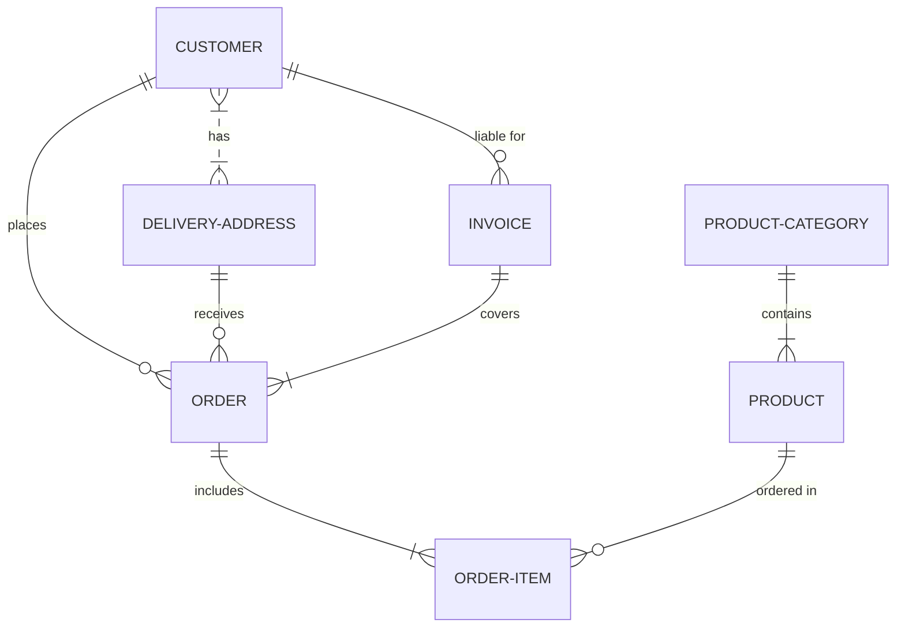
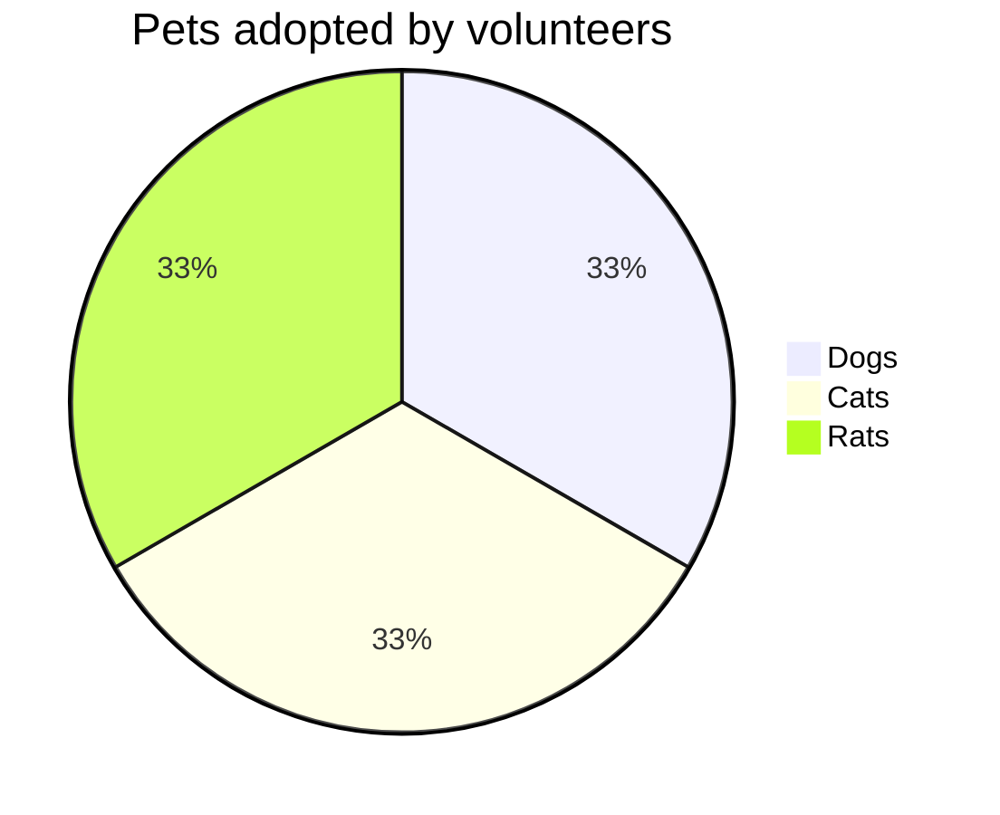

## Diagrama de Classes

```mermaid
classDiagram
  class PersonEntity
  class CepEntity
```

```mermaid!
classDiagram
  Animal <|-- Duck
  Animal <|-- Fish
  Animal <|-- Zebra
  Animal : +int age
  Animal : +String gender
  Animal: +isMammal()
  Animal: +mate()
  class Duck{
	  +String beakColor
	  +swim()
	  +quack()
  }
  class Fish{
	  -int sizeInFeet
	  -canEat()
  }
  class Zebra{
	  +bool is_wild
	  +run()
  }
```

## Fluxograma 

```mermaid
graph TD;
    A-->B;
    A-->C;
    B-->D;
    C-->D;
```

## Diagrama de Sequencia 

```mermaid
sequenceDiagram
	Alice->>+John: Hello John, how are you?
	Alice->>+John: John, can you hear me?
	John-->>-Alice: Hi Alice, I can hear you!
	John-->>-Alice: I feel great!
```

## Diagrama de Estado

```mermaid
stateDiagram
	[*] --> Still
	Still --> [*]

	Still --> Moving
	Moving --> Still
	Moving --> Crash
	Crash --> [*]
```					

## Fluxograma 

```mermaid
graph TD
  A[Christmas] -->|Get money| B(Go shopping)
  B --> C{Let me think}
  C -->|One| D[Laptop]
  C -->|Two| E[iPhone]
  C -->|Three| F[fa:fa-car Car]
```		

## Diagrama Entidade-Relacionamento

```mermaid
erDiagram  
  CUSTOMER }|..|{ DELIVERY-ADDRESS : has
  CUSTOMER ||--o{ ORDER : places
  CUSTOMER ||--o{ INVOICE : "liable for"
  DELIVERY-ADDRESS ||--o{ ORDER : receives
  INVOICE ||--|{ ORDER : covers
  ORDER ||--|{ ORDER-ITEM : includes
  PRODUCT-CATEGORY ||--|{ PRODUCT : contains
  PRODUCT ||--o{ ORDER-ITEM : "ordered in"
```

## Pizza 

```mermaid
pie title Pets adopted by volunteers
  "Dogs" : 100
  "Cats" : 100
  "Rats" : 100
```