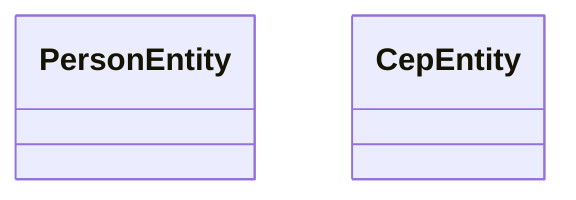
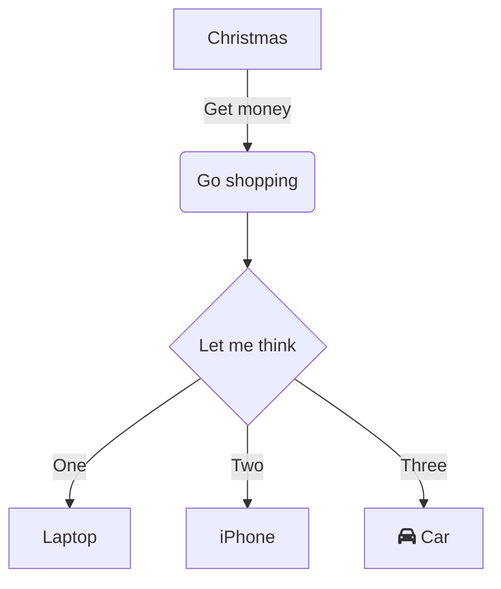
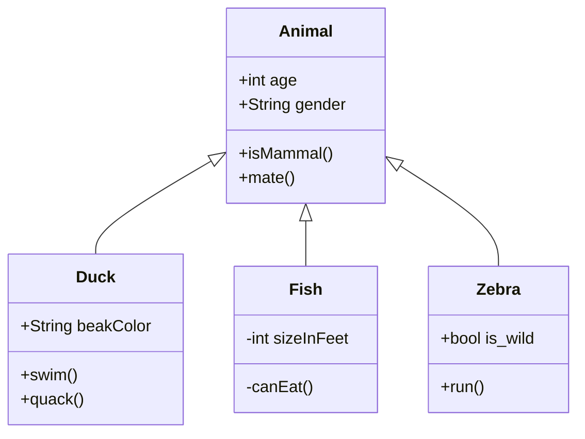

```mermaid
classDiagram
  class PersonEntity
  class CepEntity
```

```mermaid
graph TD;
    A-->B;
    A-->C;
    B-->D;
    C-->D;
```

```mermaid
graph TD
  A[Christmas] -->|Get money| B(Go shopping)
  B --> C{Let me think}
  C -->|One| D[Laptop]
  C -->|Two| E[iPhone]
  C -->|Three| F[fa:fa-car Car]
```		

```mermaid
classDiagram
  Animal <|-- Duck
  Animal <|-- Fish
  Animal <|-- Zebra
  Animal : +int age
  Animal : +String gender
  Animal: +isMammal()
  Animal: +mate()
  class Duck{
	  +String beakColor
	  +swim()
	  +quack()
  }
  class Fish{
	  -int sizeInFeet
	  -canEat()
  }
  class Zebra{
	  +bool is_wild
	  +run()
  }
```